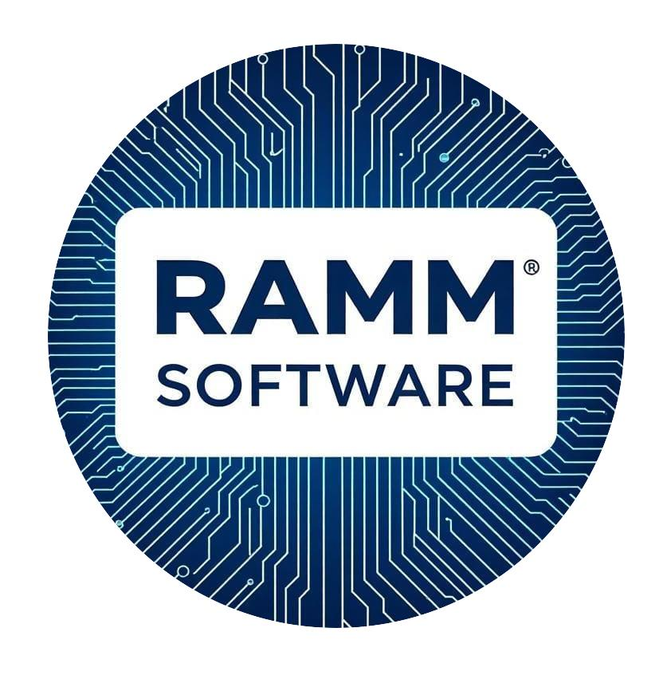

# 💻**Ingenieria-de-Software-2025**
## **Somos RAMM**
### Innovación, Diseño y Desarrollo a tu Alcance.
]
Somos RAMM, un equipo de cuatro apasionados por la tecnología, especializados en convertir ideas en aplicaciones móviles y web funcionales, intuitivas y de alto impacto.
Nacimos de la visión compartida de que la tecnología debe ser una herramienta para simplificar, potenciar y conectar. Aunque somos un equipo compacto, nuestra agilidad y dedicación nos permiten ofrecer soluciones personalizadas y de alta calidad, compitiendo con los mejores del sector.

**Nuestra Misión**: Crear soluciones de software excepcionales que impulsen el crecimiento de nuestros clientes y mejoren la vida de sus usuarios.

**Nuestra Visión**: Ser el socio tecnológico de referencia para startups y empresas en crecimiento que buscan innovación, calidad y un servicio cercano y confiable.
## **Proyecto**: NombredelaApp
// Descripcion de la aplicacion aun no implementado
## 👨👩Colaboradores:
- [Alam Meza](https://github.com/AlmMz1905)>
- Micaela Taini
- Rocio Pascual
- Manuel Toledo
# 🔧Tecnologías Utilizadas
## Front-End
## Back-End
